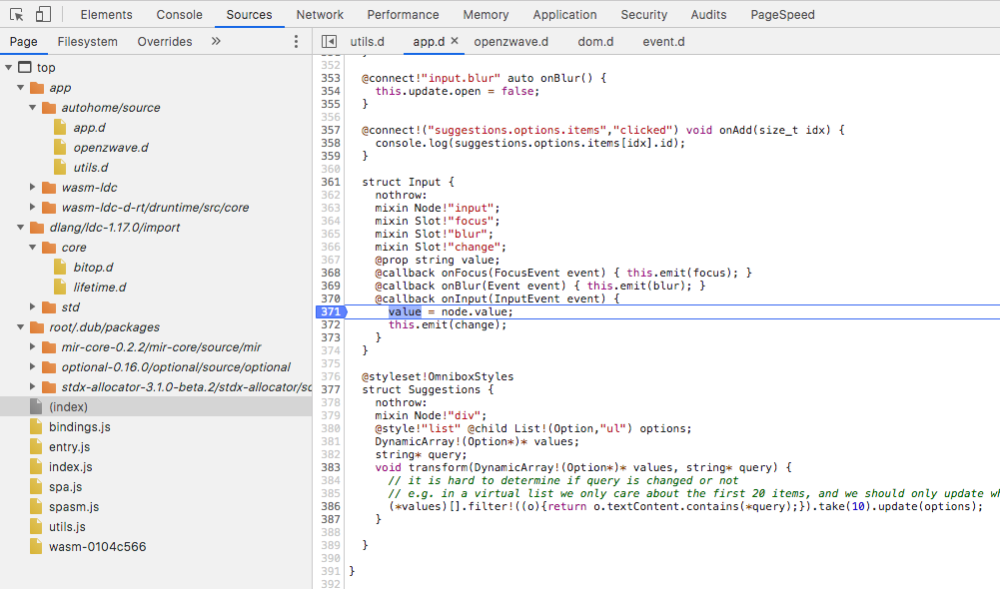

# Wasm Sourcemaps

Standalone utility to generate sourcemaps from WebAssembly files.



## How to install

First install a D compiler. `curl https://dlang.org/install.sh | bash -s` or follow the instructions at https://dlang.org/download.html

Then you can run this tools with `dub run wasm-sourcemaps -- --help`.

## Usage

Make sure your WebAssembly file contains dwarf debug information.

```
Usage: wasm-sourcemaps [--help] [--output=<string>] [--embed=<bool>]
                       [--embed-base-url=<string>] [--include-sources=<bool>] file

Positional arguments:
 file            Input file

Optional arguments:
 --help, -h      Prints this help.
 --output <string>
                 Output file, default is same as input with '.map' extension
                 added, use '-' for stdout
 --embed <bool>  embeds the sourcemap url in wasm file. Default is true. This adds a
                 sourceMappingURL custom section in the wasm file with a
                 reference to the sourcemap file. This allows browsers to
                 automatically load the sourcemap file.
 --embed-base-url <string>
                 sets the url used when embedding the sourcemap url in the
                 webassembly file. Default is './'.
 --include-sources <bool>
                 includes the source files in the sourcemap. Default is
                 'false'.
 ```

## How it works

It extracts dwarf debug information from the WebAssembly file and converts it to a sourcemap version 3.

## Limitations

D mixins aren't included in the sourcemap.

Sourcemaps themselves contain no type information so a debugger (e.g. browser devtools) will only show raw WebAssembly types (i32u, i32s, f32, f64).

## Thanks

Part of the dwarf code was taken from the [elf-d](http://code.dlang.org/packages/elf-d) project by Yazan Dabain. That code, as well as this project, is licensed under the Boost Software License, Version 1.0.
